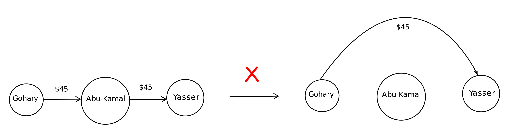
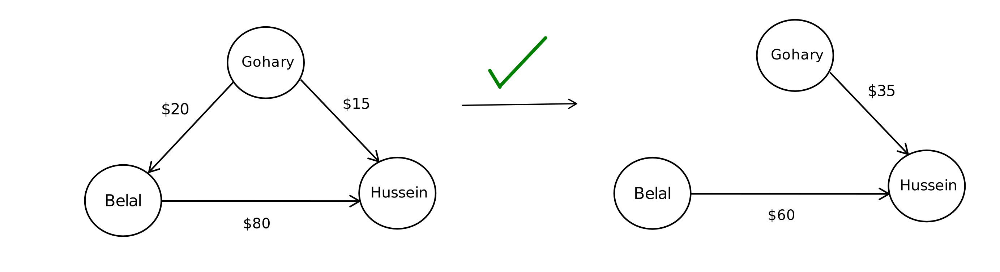
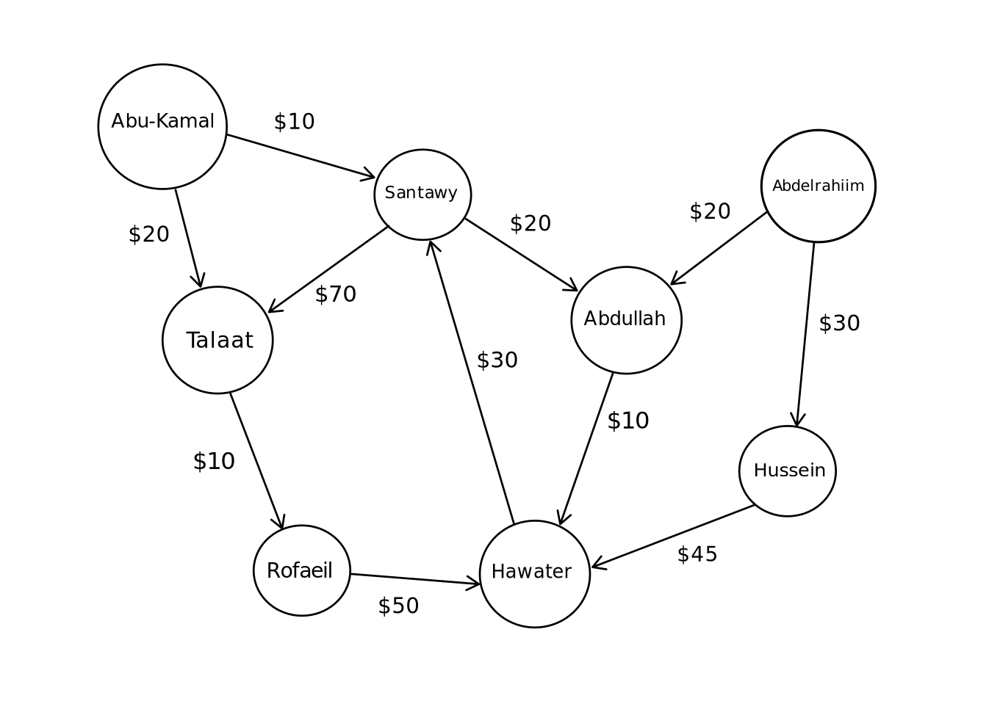
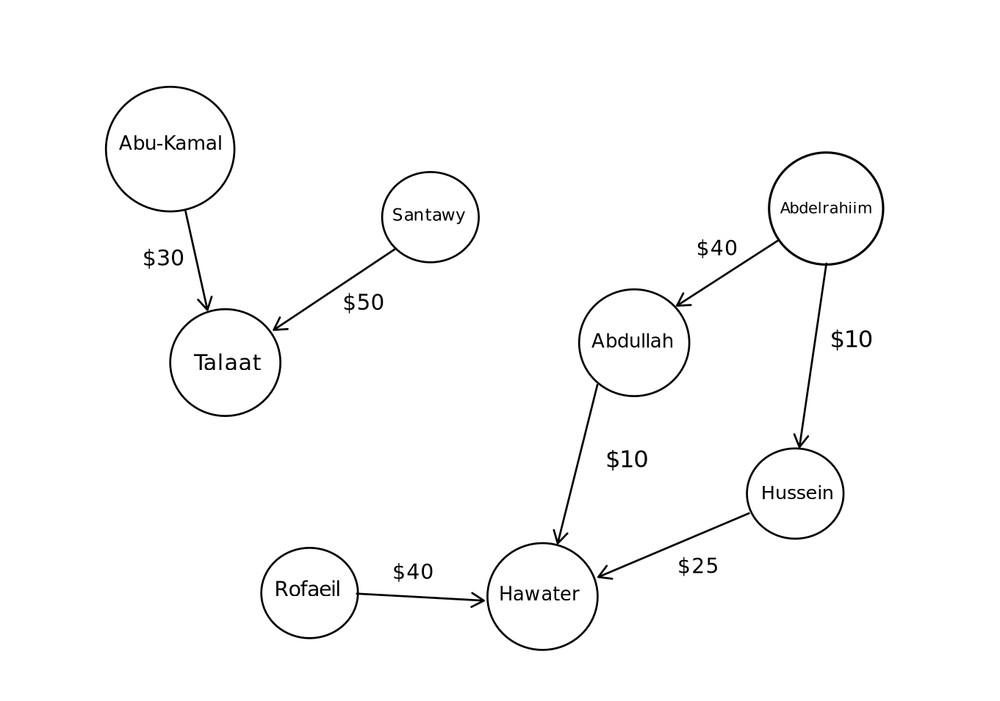

# Debt Simplification Command Line Tool (CLI)

## Motivation

There is a *communal ledger* shared between a couple of 
people, let's say between a group of friends, and now
they want to settle the debts in the most efficient way. (i.e. 
in the minimum total number of transactions so that there is no debt between any pair) 

*Definitions*:  
communal ledger: a book shared between a community that keeps track of the financial accounts.  
(i.e. how much does person A owe person B)

## Proposal

In order not to introduce ambiguity and distrust between members, we will add a 
constraint that goes like this,  
"If A didn't owe B anything in the original edger, A will not owe B anything in the simplified ledger."  
This will also prove to be useful from an algorithmic standpoint.

*Example 1*:    

*Orginal ledger*:  
Gohary owes Abu-kamal $45  
Abu-kamal owes Yasser $45

One can say that now Gohary owes Yasser $45 and that's it.  
And while the number of transaction decreased, 
this is a violation of the rule we set, since Gohary didn't owe anything to Yasser before.  



---

*Example 2*:  

*Original ledger*:  
Gohary owes Hussein $20  
Gohary owes Belal $15  
Belal owes Hussein $80

*Simplifed ledger*:  
Gohary owes Hussein $35  
Belal owes Hussein $60 

This is a valid simplification as both Gohary and Belal owed Hussein some amount in the original ledger.



## Usage 


Open the terminal and run the following command

```
git clone https://github.com/AhmedEl-Gohary/debt-simplifier-cli
```  

You can either run the executable file `main` or compile locally using the following command

```
g++ -std=c++20 debt-simplifier-cli/src/*.cpp -o main
```

The simplifier takes either 1 or 2 arguments, the original ledger file and an optional output file for the simplified ledger.  
Note that if the second argument is not given the simplified ledger will be written to the standard output.  

Ledger file format
```
<debtor name> <creditor name> <amount of money>
```

meaning that *debtor* owes *creditor* amount of money  

---

To run the code locally, first create the `original_ledger.txt` file then run the following command

```
./main original_ledger.txt
```

If you want the simplified ledger to be written into a file run the following command instead

```
./main original_ledger.txt simplified_ledger.txt
```  

## How it works  

The ledger is modeled as a directed weighted graph where the arc is directed from the debtor to 
the creditor.  
From the aforementioned constraint, it follows that we can only change the weight of an edge but  
we cannot add a new one, thus it makes sense that we want to greedily maximize the flow (amount of money) 
through each edge and therefore the problem boils down to finding the maximum flow through each edge.  
The resulting graph will be one with the minimum number of edges which is what we want.  

> **Note:** You can find the following input ledger in the sample file above  

   


> The simplified ledger contains 7 transaction instead of 11  

 


## Algorithmic details  

The algorithm uses the Ford-Fulkerson method + capacity scaling heuristic to compute the maximum flow
through each edge. As long as there is a non-visited edge going from u to v, it computes the maximum
flow where u is the source and v is the sink and produces the residual graph which is then passed as
the input graph again.   
The time complexity of the algorithm is O(M * T) where T is the time complexity of the max flow algorithm.  
T = O(M^2 * log(Threshold)), where M is the number of edges and Threshold is a large constant ~= 1e9.  
Thus, the total time complexity is O(M^3 * log(Threshold)). Following from this time complexity,
in the worst case where the ledger is a complete graph (i.e. every one has a debt to every one else),
the expected running time is around (1 - 3) seconds for N <= 30, where N is the number of people.


